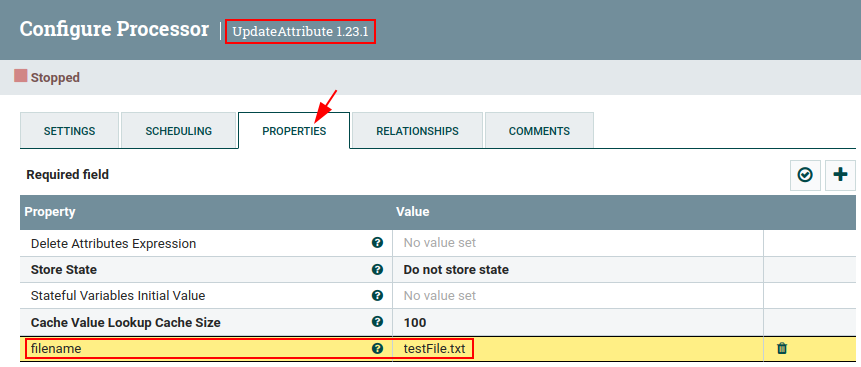

# AppendToFile
This custom processor append the content of FlowFiles (as string) to the end of a file that previously exists.

## Video tutorial
* [Apache NiFi: Develop custom processor AppendToFile (Spanish audio)](https://youtu.be/WXxvAxEgxgQ)

## Testing
1. Create the following NiFi Flow.
      

2. **GenerateFlowFile** processor configuration.
      

3. **UpdateAttribute** processor configuration.
      

4. **PutFile** processor configuration.
      

5. **AppendToFile** custom processor configuration.
      

6. When starting NiFi Flow you can see that the first time the **PutFile** processor will create the file and the FlowFile will come out through the "*success*" relationship.
      

7. The second and subsequent times, **PutFile** will fail (that's how it is configured in properties) because the file to write (testFile.txt) already exists in destination path. This is not a problem, it is just what we need for the FlowFile to be redirected through the "*failure*" relationship to the custom processor **AppendTofile**.
      

8. The three queued FlowFiles come out through the "*success*" relationship.
      

9. Finally, inspect the destination file to check if it has added each FlowFile as a string at the end of the file.
    

