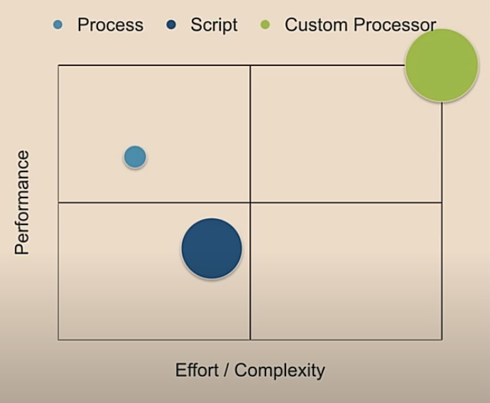

# Apache NiFi custom processors
 

In this repository, I publish some custom processors for Apache NiFi that I develop as needs arise or for use cases that cannot be addressed with any of the original processors included in the NiFi installation.

Additionally, I include instructional videos in which I explain step by step how I've developed these processors to make their understanding easier.

## Video
* [Apache NiFi: Develop custom processor (Spanish audio, English subtitles)](https://youtu.be/LfiUmvOHgPo)

## Performance Vs Effort/Complexity
There are several reasons why it may be interesting to develop your own NiFi custom processor. The main reason is that you need to perform some data processing that cannot be handled by any of the existing processors in the NiFi catalog. So, "if it doesn't exist, create it."

The following chart provides a comparison of different solutions available, such as running a system process, running a script (Ruby, Groovy, Jython, etc.), or developing your own custom processor with Maven + Java. The latter option is the most challenging but also the most efficient in terms of performance and yield.

## Dependencies
* GNU/Linux
* Maven
* SDK Java 1.8
* Docker-Compose (Optional)
* IntelliJ (Optional)

## Custom processors
* [AppendToFile](https://github.com/JavDomGom/nifi-custom-processors/tree/main/AppendToFile)